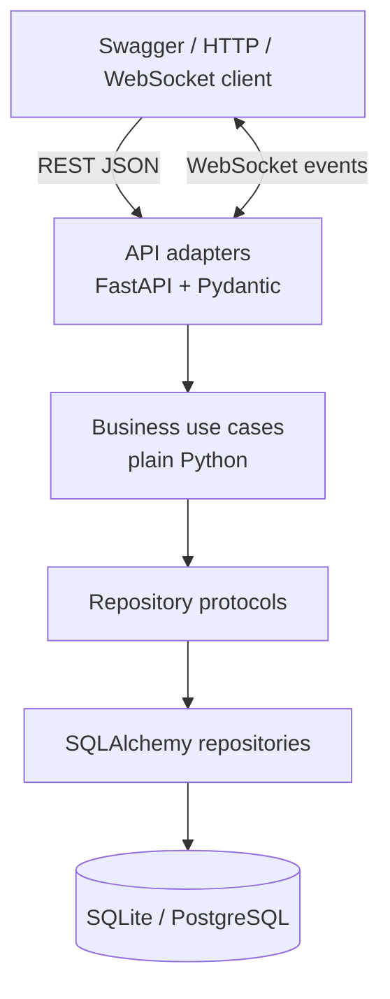
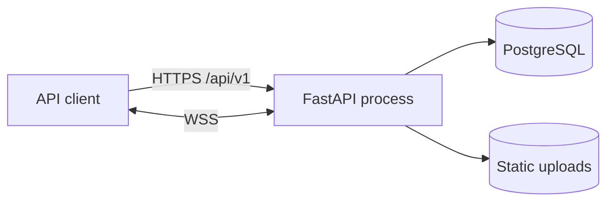
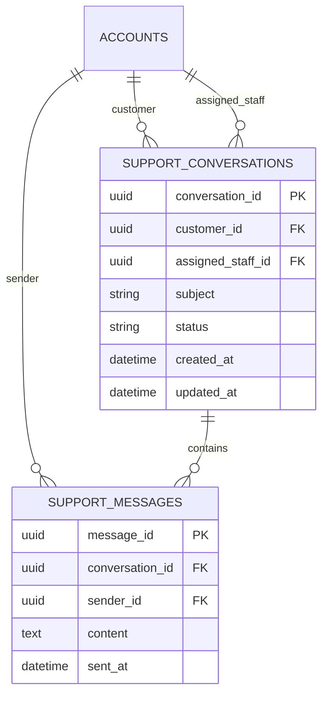

# Kiến trúc hệ thống

## Mục tiêu và giới hạn

Pha 1 ưu tiên tính đúng, dễ đọc và có thể kiểm thử trên một máy. Nghiệp vụ trọng tâm là chuyển yêu cầu quan tâm xe từ kênh online sang nhân viên thật qua báo giá, lịch lái thử và hội thoại realtime. Hệ thống không thực hiện tư vấn tự động.

## Phân tầng

Quy tắc dependency:

- API chịu trách nhiệm HTTP, schema, status code, dependency injection và broadcast.
- Business chịu trách nhiệm quyền nghiệp vụ, state transition và validation. `backend/src/services/support_chat.py` không import web framework hoặc DB library.
- Repository protocol mô tả đúng dữ liệu use case cần. SQLAlchemy adapter chuyển ORM row thành dataclass nghiệp vụ.
- ORM model chỉ mô tả lưu trữ; client không truy cập database trực tiếp.

Catalog, báo giá và lịch lái thử là các module có sẵn được giữ lại làm chức năng hỗ trợ. Chat là vertical slice chuẩn để nhóm áp dụng khi tiếp tục tách các module cũ ở Pha 2.

## Thành phần runtime

Không có kết nối từ client tới PostgreSQL và không có provider cần API key. Docker Pha 1 chỉ đóng gói backend. Với một process, WebSocket connections được giữ trong memory; tin nhắn luôn ghi database trước khi broadcast.

## Mô hình dữ liệu chat

## Bảo mật

- Password được băm bằng bcrypt; JWT ký bằng `SECRET_KEY`.
- `get_current_user` là cổng xác thực tập trung cho HTTP; `require_roles` thực hiện RBAC.
- WebSocket giải mã cùng loại JWT, nạp account còn hoạt động và gọi cùng business service để kiểm tra ownership.
- Đăng ký công khai luôn tạo `customer`; chỉ admin tạo staff hoặc đổi role.
- Backend ghi đè danh tính trên quote/booking bằng account từ token.
- CORS dùng allowlist từ cấu hình. Container chạy non-root.
- Secret chỉ truyền qua environment và không được commit.

## Tính nhất quán và lỗi

- Tin nhắn được commit trước khi broadcast nên lịch sử REST là nguồn sự thật.
- Ownership được kiểm tra trước đọc/ghi/xóa.
- Conversation đóng không nhận thêm message.
- API map lỗi nghiệp vụ thành `403`, `404`, `422`; lỗi xác thực thành `401`.
- Với Pha 1, migration dùng `create_all` để đơn giản hóa. Pha 2 nên đưa Alembic vào quy trình release.

## Khả năng kiểm thử

- Unit test business service bằng fake repository, không cần FastAPI/database.
- Integration test dùng SQLite tạm và HTTPX để kiểm tra auth, ownership và full chat flow.
- OpenAPI contract test kiểm tra endpoint, schema và security declaration.
- Load script chỉ gọi endpoint đọc, phù hợp chạy nhiều lần trên Kaggle CPU.

## Thuộc tính chất lượng Pha 2

Mỗi cải tiến phải đo trên cùng Kaggle CPU, cùng dataset, concurrency, duration và commit.

| Thuộc tính | Baseline Pha 1 | Cải tiến đề xuất | Chỉ số trước/sau |
|---|---|---|---|
| Hiệu năng đọc catalog | Query trực tiếp | Pagination, index, response cache có TTL | RPS, p50/p95/p99, error rate |
| Khả năng mở rộng realtime | Connection manager trong 1 process | Redis Pub/Sub và nhiều worker | concurrent sockets, delivery latency, loss rate |
| Tin cậy | Commit rồi broadcast | outbox/event relay và idempotency key | duplicate/lost event rate |
| Dễ thay đổi DB | `create_all` | Alembic migration + rollback drill | thời gian deploy/rollback, migration failures |
| Quan sát | application log | request ID, structured log, Prometheus metrics | MTTD, error trace coverage |
| Bảo mật | access JWT | short-lived access + refresh rotation, rate limit | blocked abuse rate, token exposure window |

Không triển khai tất cả chỉ để “có công nghệ”. Nhóm chọn 1–2 nút thắt được baseline chứng minh, ghi giả thuyết, thay đổi một biến và báo cáo kết quả lặp tối thiểu ba lần.

## ADR ngắn

### ADR-01: WebSocket + REST thay vì chỉ WebSocket

REST đơn giản cho history/retry và xuất hiện trong OpenAPI; WebSocket chỉ đảm nhiệm push realtime. Mất socket không làm mất khả năng gửi.

### ADR-02: Repository protocol ở business layer

Use case phụ thuộc contract Python nhỏ thay vì AsyncSession. Điều này đáp ứng dependency rule và giúp unit test nhanh.

### ADR-03: SQLite local, PostgreSQL shared

SQLite giảm thời gian setup; PostgreSQL phù hợp môi trường nhóm và load test. Toàn bộ access đi qua SQLAlchemy async để giới hạn khác biệt.

### ADR-04: Không dùng dịch vụ tư vấn tự động

Phạm vi mới cần luồng con người xử lý được, không phụ thuộc key, quota, prompt hoặc dữ liệu vector. Chi phí vận hành và rủi ro câu trả lời sai được loại khỏi Pha 1.
