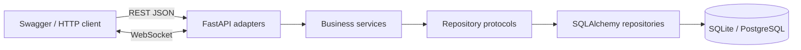

# Sơ đồ kiến trúc

Tài liệu này được giữ làm đường dẫn tương thích. Sơ đồ và giải thích cập nhật nằm tại [ARCHITECTURE.md](ARCHITECTURE.md).

```mermaid
flowchart LR
    Client[Swagger / HTTP client] -->|REST JSON| API[FastAPI adapters]
    Client <-->|WebSocket| API
    API --> SVC[Business services]
    SVC --> PORT[Repository protocols]
    PORT --> REPO[SQLAlchemy repositories]
    REPO --> DB[(SQLite / PostgreSQL)]
```
